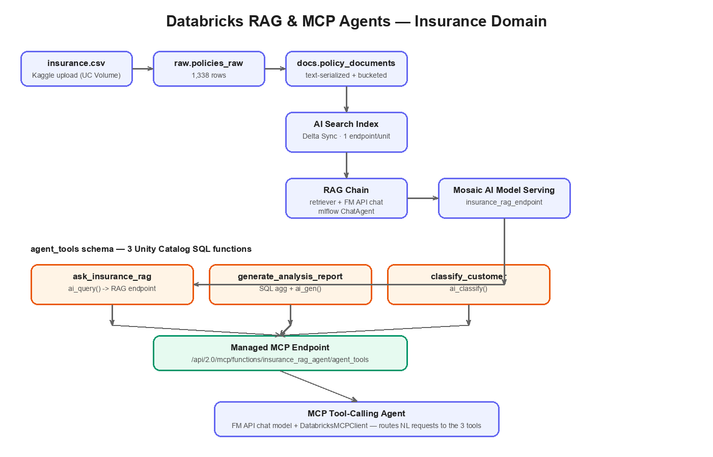

<p align="center">
  
</p>

<h1 align="center">Databricks RAG & MCP Agents</h1>

<p align="center">
  <em>A production-style RAG chatbot and MCP tool-calling agent built on Databricks, Unity Catalog,
  Mosaic AI Vector Search, and Mosaic AI Model Serving</em>
</p>

<p align="center">
  
  
  
  
</p>

---

## Overview

This project answers natural-language questions about an insurance policy dataset with a
Retrieval-Augmented Generation (RAG) chain deployed on **Mosaic AI Model Serving**, then
wraps that chain — plus an analysis-report generator and a customer classifier — as **Unity
Catalog functions** exposed through a **Databricks-managed MCP server**. A single MCP
tool-calling agent discovers all three tools over the real MCP protocol and routes each
request to the right one.

| Stage | Purpose | Table / Output |
|:-----:|---------|----------------|
| **Ingest** | Land the raw Kaggle insurance table | `insurance_rag_agent.raw.policies_raw` |
| **Prepare** | Text-serialize rows into retrievable documents | `insurance_rag_agent.docs.policy_documents` |
| **Index** | Embed documents for semantic search | `insurance_rag_agent.docs.policy_documents_index` |
| **RAG + Serve** | Retriever + FM API chat, deployed as a serving endpoint | `insurance_rag_endpoint` |
| **Agent Tools** | RAG / report / classify as UC functions | `insurance_rag_agent.agent_tools.*` |
| **MCP Agent** | Tool-calling agent over the managed MCP endpoint | demo transcript |

---

## Dataset

- **Kaggle:** [Medical Cost Personal Datasets](https://www.kaggle.com/datasets/mirichoi0218/insurance)
  by `mirichoi0218` — 1,338 rows, 7 columns: `age, sex, bmi, children, smoker, region, charges`.
- Purely structured/tabular, so `src/01_prepare_policy_documents` text-serializes each row into
  a one-paragraph natural-language "policy profile" (e.g. *"Policyholder 42: a 52-year-old
  male from the southeast region, a smoker, with a BMI of 34.1 and 2 dependent(s). Annual
  insurance charge: $39,611.75."*). This is what makes a plain table usable as a RAG corpus,
  and it gives the classify/report tools real ground-truth columns (`region`, `smoker`,
  `charges_tier`) to work with.
- Tiny by design — 1,338 rows embed and index almost instantly on Free Edition's single
  Vector Search unit, the same scale class as the other projects in this portfolio.

---

## Unity Catalog Structure

```
insurance_rag_agent (catalog)
├── raw           ← ingested source table
├── docs          ← text-serialized documents + Vector Search index
└── agent_tools   ← the 3 UC functions exposed via managed MCP
```

Schemas are created automatically on first run via `CREATE SCHEMA IF NOT EXISTS`.

---

## Project Structure

```
databricks-rag-and-mcp-agents/
├── schema_mgt/
│   └── 00_setup_and_data_ingest.ipynb
├── src/
│   ├── 01_prepare_policy_documents.ipynb
│   ├── 02_vector_search_index.ipynb
│   ├── 03_rag_chain_and_deploy.ipynb
│   ├── 04_agent_tools_mcp_functions.ipynb
│   └── 05_mcp_tool_calling_agent.ipynb
├── docs/
│   ├── architecture_diagram.png
│   └── SETUP.md
├── .gitignore
├── LICENSE
└── README.md
```

---

## Getting Started

### Prerequisites
- A **Databricks Free Edition** workspace (serverless-only, Unity Catalog enabled by default).
- The [Medical Cost Personal Datasets](https://www.kaggle.com/datasets/mirichoi0218/insurance)
  `insurance.csv` file downloaded locally.
- Access to Foundation Model APIs and a Foundation embedding model in **Serving > Foundation
  Models** (both included in Free Edition, pay-per-token).

See **[docs/SETUP.md](docs/SETUP.md)** for a full click-by-click setup walkthrough.

### Step-by-Step Setup
1. Clone the repo and import the notebooks into your workspace (**Workspace > Import**, or
   connect the repo via **Repos**).
2. Create the `insurance_rag_agent` catalog/Volume (done automatically by notebook 00) and
   upload `insurance.csv` to the Volume path it prints.
3. Run the notebooks in order:

| Step | Notebook | Description |
|:----:|----------|-------------|
| 0 | `schema_mgt/00_setup_and_data_ingest` | Create catalog/schemas/volume, land the raw table |
| 1 | `src/01_prepare_policy_documents` | Bucket + text-serialize rows into RAG documents |
| 2 | `src/02_vector_search_index` | Create the AI Search endpoint + Delta Sync index |
| 3 | `src/03_rag_chain_and_deploy` | Build, log, register, and deploy the RAG chain |
| 4 | `src/04_agent_tools_mcp_functions` | Register the 3 UC functions (RAG/report/classify) |
| 5 | `src/05_mcp_tool_calling_agent` | Run the MCP tool-calling agent demo |

---

## Notebook Details

- **`00_setup_and_data_ingest`** — creates the catalog, `raw`/`docs`/`agent_tools` schemas,
  and a Volume; reads the uploaded CSV and writes `raw.policies_raw` with ingestion lineage.
- **`01_prepare_policy_documents`** — derives `age_bucket` and `charges_tier` (Low/Medium/High
  from the data's own percentiles), text-serializes each row, writes `docs.policy_documents`
  with a primary key and Change Data Feed enabled (required by Vector Search).
- **`02_vector_search_index`** — creates a single `STANDARD` AI Search endpoint and a Delta
  Sync Index over `policy_text` using the `databricks-gte-large-en` embedding model; validates
  with a sample similarity search.
- **`03_rag_chain_and_deploy`** — defines an `mlflow.pyfunc.ChatAgent` that retrieves top-k
  documents and grounds a Foundation Model API chat completion in them, then logs/registers it
  to Unity Catalog and deploys it to a Mosaic AI Model Serving endpoint.
- **`04_agent_tools_mcp_functions`** — registers `ask_insurance_rag`, `generate_analysis_report`,
  and `classify_customer` as Unity Catalog SQL functions, automatically exposed via the managed
  MCP endpoint `/api/2.0/mcp/functions/insurance_rag_agent/agent_tools`.
- **`05_mcp_tool_calling_agent`** — connects a `DatabricksMCPClient`, discovers the 3 tools,
  and runs a tool-calling loop across 3 demo prompts (one per tool), printing the full
  transcript.

---

## Architecture Deep Dive

### Why text-serialize a structured table for RAG?

RAG assumes a corpus of natural-language documents, but this dataset is a plain table of
numbers and categories. Rather than force a document-shaped dataset onto a use case that
doesn't have one, each row is rendered into a one-paragraph description at prepare-time. The
technique is deliberately simple (an f-string over typed columns) and it keeps the metadata
(`region`, `smoker`, `charges_tier`) alongside the text, so the same table backs semantic
search *and* the structured aggregation used by the analysis-report tool.

### Why one schema for all 3 agent tools?

```
┌──────────────────┐     ┌───────────────────────────┐     ┌────────────────────┐
│  ask_insurance_rag│     │ generate_analysis_report  │     │ classify_customer  │
└─────────┬─────────┘     └─────────────┬─────────────┘     └──────────┬─────────┘
          │                             │                              │
          └─────────────────────────────┼──────────────────────────────┘
                                         ▼
                   /api/2.0/mcp/functions/insurance_rag_agent/agent_tools
                                         │
                                         ▼
                            MCP tool-calling agent (05)
```

Putting all three UC functions in one `agent_tools` schema means Databricks' managed MCP
server exposes all of them at a **single URL** with no custom server process, no extra compute,
and Unity Catalog governance (grants on the schema control what the agent can call) — the most
idiomatic way to build MCP tools on Databricks today.

| Principle | Implementation |
|-----------|---------------|
| RAG via real Model Serving | `03` deploys a `ChatAgent` to its own Mosaic AI Model Serving endpoint, queried by `ask_insurance_rag` via `ai_query()` |
| Governed tool discovery | Tools are UC functions, not hardcoded Python — grants and lineage apply automatically |
| No custom infrastructure | Managed MCP server, not a self-hosted MCP process |
| Lineage | `ingestion_timestamp` / `source_file` columns on every ingested table |
| Idempotency | `CREATE SCHEMA IF NOT EXISTS`, `DROP TABLE IF EXISTS`, `CREATE OR REPLACE FUNCTION` |

### Technology Stack
| Component | Technology |
|-----------|-----------|
| Compute | Databricks (serverless, Free Edition) |
| Storage | Delta Lake (ACID, Change Data Feed) |
| Governance | Unity Catalog |
| Retrieval | Mosaic AI Vector Search (Delta Sync Index) |
| Generation | Foundation Model APIs (pay-per-token) |
| Serving | Mosaic AI Model Serving (Agent Framework `agents.deploy`) |
| Tool protocol | Databricks-managed MCP servers over Unity Catalog functions |
| Source Data | [Medical Cost Personal Datasets](https://www.kaggle.com/datasets/mirichoi0218/insurance) |

---

## Sample Output

A single run of `05_mcp_tool_calling_agent` routes three different requests to three
different tools:

```
=== User: What do the records show about smokers in the southeast region with high charges? ===
--> Calling MCP tool: ask_insurance_rag({'question': '...'})
Assistant: The records show southeast smokers have a notably higher average charge...

=== User: Generate an analysis report comparing smokers vs. non-smokers in the southeast. ===
--> Calling MCP tool: generate_analysis_report({'p_region': 'southeast', 'p_smoker': 'yes'})
Assistant: Southeast smokers average $32,xxx in annual charges versus $8,xxx for non-smokers...

=== User: Classify this applicant: 52-year-old smoker, BMI 34, from the southeast, with 2 children. ===
--> Calling MCP tool: classify_customer({'description': '...'})
Assistant: This applicant classifies as High Risk...
```

---

## Free Edition Notes

- Exactly **one** AI Search endpoint / one search unit is created and reused — never create a
  second endpoint.
- Vector Search uses a **Delta Sync Index** (Direct Vector Access indexes aren't available on
  Free Edition).
- The deployed RAG endpoint and Foundation Model API calls use **pay-per-token, CPU serverless
  serving** — no GPU serving or provisioned throughput, which Free Edition doesn't support.
- `agents.deploy()` and the MCP agent both draw on Free Edition's limited model-serving/app
  quota — stop or delete the `insurance_rag_endpoint` serving endpoint after demoing if quota
  runs low.

---

## Extending the Pipeline

- Add a Databricks App (Streamlit/Gradio) as a chat UI in front of the deployed RAG endpoint.
- Swap `classify_customer`'s zero-shot `ai_classify()` for a trained classifier registered in
  Unity Catalog, compared against the `charges_tier` ground truth already in `docs.policy_documents`.
- Add MLflow evaluation (`mlflow.genai.evaluate`) to score the RAG chain's answers against a
  labeled question set.
- Register the vector index and RAG endpoint's Foundation Model calls through **AI Gateway**
  for centralized rate limiting and usage tracking.

---

## License
MIT — see [LICENSE](LICENSE).

## Acknowledgments
- **Dataset:** [Medical Cost Personal Datasets](https://www.kaggle.com/datasets/mirichoi0218/insurance) (Kaggle, `mirichoi0218`)
- **Platform:** [Databricks](https://www.databricks.com/) Free Edition with Unity Catalog
- **Patterns:** [Mosaic AI Vector Search](https://docs.databricks.com/aws/en/vector-search/vector-search), [Mosaic AI Agent Framework](https://docs.databricks.com/aws/en/generative-ai/agent-framework/create-chat-model), [Databricks-managed MCP servers](https://docs.databricks.com/aws/en/generative-ai/mcp/managed-mcp)
